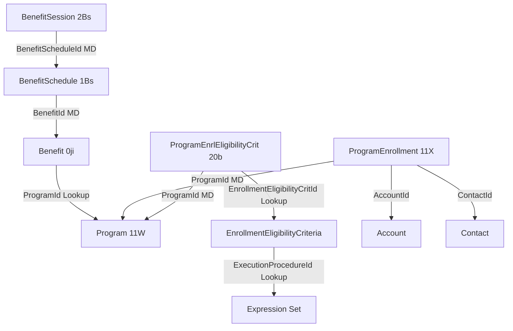

# ISANS — Data model (verified against `vscodeOrg`)

Authoritative on-org facts used by the rest of the spec. All checks performed via **Tooling API** against instance `storm-f2e38d8c037830.my.salesforce.com`. Reproduce commands are in [org-object-verification-vscodeOrg.md](org-object-verification-vscodeOrg.md).

## 1. Objects confirmed present

| API name | Key prefix | Role in ISANS design |
|----------|-----------|-----------------------|
| `Program` | `11W` | Top-level program container (e.g., LINC). |
| `Benefit` | `0ji` | Specific offering within a program (e.g., LINC Basics). Lookup to `Program` via `ProgramId`. |
| `BenefitSchedule` | `1Bs` | Recurring cadence linked MD to `Benefit`. |
| `BenefitSession` | `2Bs` | Individual occurrences linked MD to `BenefitSchedule`. |
| `ProgramEnrollment` | `11X` | Client enrollment record. Has **both** `AccountId` and `ContactId` — either wiring works. |
| `ProgramEnrlEligibilityCrit` | `20b` | Junction: Program ↔ EnrollmentEligibilityCriteria. |
| `EnrollmentEligibilityCriteria` | — | **Rule definition** — links to an Expression Set (see §3). |
| `AssessmentQuestion`, `AssessmentQuestionResponse` | — | Discovery Framework Q&A pair. Use `AssessmentQuestionResponse` wherever the canvas says `AssessmentResponse`. |

## 2. Objects missing vs canvas — decisions required

| Planned in canvas | Reality on `vscodeOrg` | Recommended decision |
|--------------------|-------------------------|------------------------|
| `BenefitEnrollment` | **Not present.** Benefit-level participation is already modeled via attendance / disbursement rollups (see §4). | Do **not** create a custom `BenefitEnrollment__c`. Use the existing attendance/disbursement pattern. (Pending confirmation.) |
| `AssessmentResponse` | Org uses `AssessmentQuestionResponse`. | Rename in Apex, Flow, docs. |
| `AssessmentQuestionSourceDocument` | Not present. | Add custom `Assessment_Source_Document__c` referenced from `EnrollmentEligibilityCriteria` **or** a custom field on `ProgramEnrlEligibilityCrit` (`Source_Document__c`). Pending decision. |
| `Benefit_Enrollment_Eligibility_Criteria__c` | Not present. | Create custom object (plan §phase 2). |
| `Eligibility_Question_Mapping__c` | Not present. | Create custom object (plan §phase 2). |
| `Delivery_Site__c` | Not present. | Create custom object (plan §phase 2). |
| `Funder_Seat_Allocation__c` | Not present. | Create custom object (plan §phase 2). |

## 3. Critical finding — eligibility uses **Expression Set**, not row-based comparison

The canvas assumed `EnrollmentEligibilityCriteria` carries `Logic_Operator__c`, `Target_Value__c`, `Data_Type__c` and that the Apex waterfall would compare those values to assessment responses.

**Actual fields on `EnrollmentEligibilityCriteria`:**

| Field | Type |
|--------|------|
| `Name` | Text(255) |
| `Description` | Long Text |
| `Status` | Picklist |
| **`ExecutionProcedureId`** | **Lookup(Expression Set)** |
| `IsLocked`, `MayEdit` | System |
| `PublishedBy`, `SourceSystem`, `SourceSystemIdentifier` | Provenance |
| `CurrencyIsoCode` | Picklist |

**Implication:** NPC evaluates eligibility by **invoking an Expression Set** (Business Rules Engine). The ISANS engine does **not** need a custom AND/OR-group row evaluator — it needs to (a) run the Expression Set referenced by each criterion's `ExecutionProcedureId` with the client record as input, and (b) aggregate results.

**What must change in the spec**
- Replace the “Logic_Operator__c / Target_Value__c / Data_Type__c / Logic_Group__c” section with a call-Expression-Set flow (see **[03-eligibility-engine.md](03-eligibility-engine.md)** when written).
- `Eligibility_Question_Mapping__c` may become unnecessary if each rule is already self-contained in an Expression Set. Keep only if multiple mappings of questions to the same rule are needed and cannot be expressed in the Expression Set's input resolution.
- `ProgramEnrlEligibilityCrit` **has no `Failure_Message__c` or `Source_Document__c` out of the box.** Either add custom fields to it, or surface failure messages from the Expression Set result structure if available.

## 4. Benefit attendance / disbursement model (already on org)

`Benefit`, `BenefitSession`, and `ProgramEnrollment` all carry attendance / disbursement counters, indicating the installed package (there are `NGO_CaseMan_*` custom formula/rollup fields) already models "participation" as **attendance** per `BenefitSession`, rolled up to `Benefit` and `ProgramEnrollment`.

Notable custom fields already present:

| Object | Field | Type |
|--------|--------|------|
| `Benefit` | `NGO_CaseMan_isSessionBenefit__c` | Checkbox |
| `Benefit` | `NGO_CaseMan_Total_Enrolled__c` | Roll-Up (Benefit Schedule) |
| `Benefit` | `NGO_CaseMan_Total_Attended__c` | Roll-Up |
| `Benefit` | `NGO_CaseMan_Total_Unattended__c` | Roll-Up |
| `Benefit` | `NGO_CaseMan_Attendance_Rate__c` | Formula |
| `BenefitSession` | `NGO_CaseMan_Total_Enrolled__c`, `_Total_Attended__c`, `_Total_Unattended__c`, `_Attendance_Rate__c`, `_Attendance_Summary__c` | Roll-ups/Formulas |
| `ProgramEnrollment` | `Number_of_Absent_Benefit_Disbursements__c`, `Number_of_Attended_Benefit_Disbursements__c`, `External_Id__c` | NGO extensions |

**Implication:** A client “enrolling” in a benefit is expressed as `ProgramEnrollment` + per-session attendance rows — not a separate `BenefitEnrollment` object. Seat assignment and funder tracking from the canvas must be modeled as custom fields on `ProgramEnrollment` (or on a lighter custom join) rather than a new top-level object.

## 5. Program ↔ Client wiring

- `ProgramEnrollment.AccountId` (Lookup to Account) and `ProgramEnrollment.ContactId` (Lookup to Contact) both exist.
- `Program` itself has **no** client lookup — clients are only linked through `ProgramEnrollment`.
- **Person Accounts: DISABLED** on `vscodeOrg` (`Account.IsPersonAccount = false` on sampled rows). Therefore a client is always **Account + Contact**, never a single Person Account row.
- **Case → client decision (resolved):** `Case.ContactId` is the client; `Case.AccountId` is the client's owning household/record Account. Both fields exist on Case (verified via `FieldDefinition`).
- Practical consequence: each ISANS client requires a paired `(Account, Contact)` — either an NPSP-style private household Account per client or a shared "ISANS Clients" Account bucket. See [04-client-model.md](04-client-model.md) (TBD) for the decision.

## 6. Relationship map (verified)

## 7. Open questions — status

| # | Question | Status | Answer / next step |
|---|----------|--------|---------------------|
| 1 | Case → client wiring | **Resolved** | `Case.ContactId` is the client; `Case.AccountId` is the owning Account. Person Accounts disabled. |
| 2 | Benefit-level enrollment model | Open | No `ProgramEnrollment` or `Benefit` records exist yet on `vscodeOrg`. Attendance/disbursement pattern from §4 is viable; still need user call on whether to add a dedicated join for seat+funder. |
| 3 | Source-document authority | Open | Decision deferred — proposing `Assessment_Source_Document__c` (master) + `Source_Document__c` lookup on `ProgramEnrlEligibilityCrit` in [03-eligibility-engine.md](03-eligibility-engine.md). |
| 4 | Expression Set input contract | Open | The 2 ExpressionSet records on org (`Repair Eligibility`, `Cirrus - Commerce Default Pricing Procedure`) are demo assets, not ISANS rules. Input contract must be **defined by us** when we author the first ISANS rule. See [03-eligibility-engine.md](03-eligibility-engine.md). |
| 5 | `NGO_CaseMan_*` package | **Resolved** | Fields have `NamespacePrefix = null` — they are **unpackaged, org-local** custom fields, not from a managed package. No upgrade/deploy risk; we own them. |
| 6 | `CGC_Program__c` | **Resolved** | Unrelated demo object. Fields include `Completed_Exercises__c`, `Completed_Milestones__c`, `Milestone_Icon_Type__c`, rollup of "Demo Section". Safe to ignore. |
| 7 | **NEW — Data API access to NPC objects** | Open (blocker for Apex) | `EntityDefinition.IsQueryable = true` for `Program`/`Benefit`/etc via Tooling API, but `SELECT ... FROM Program` via the standard Data API returns `sObject type 'Program' is not supported`. The authed CLI user is missing Object-level Read on the NPC entities. Must be fixed before any SOQL/Apex touches these objects. |
