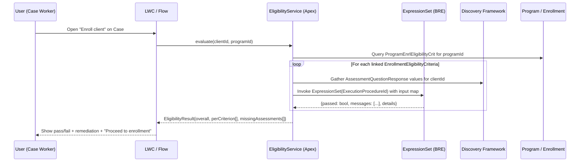

# ISANS — Eligibility engine (Expression Set based)

Replaces the canvas's "row-based criteria evaluator" with the native Salesforce pattern that ships on `vscodeOrg`: eligibility is expressed as **Expression Sets** (Business Rules Engine), referenced from `EnrollmentEligibilityCriteria.ExecutionProcedureId`, and tied to a Program through the `ProgramEnrlEligibilityCrit` junction.

> See [02-data-model.md §3](02-data-model.md) for the underlying schema finding.

## 1. Why Expression Sets (and why not a custom evaluator)

The canvas drafted `Logic_Operator__c` / `Target_Value__c` / `Data_Type__c` / `Logic_Group__c` fields on `EnrollmentEligibilityCriteria`. **Those fields do not exist** on the standard object — only `Name`, `Description`, `Status`, `ExecutionProcedureId` (Lookup → `ExpressionSet`), plus system/provenance fields.

Authoring a custom evaluator on top of that object would either:

- Add more custom fields that duplicate Business Rules Engine concepts, or
- Require a parallel junction of our own.

Neither is justified when the native hook (`ExecutionProcedureId`) is already present and the org already has **OmniStudio** installed as a package (seen in `InstalledSubscriberPackage`). We'll use Expression Sets.

### 1.1 How to configure a rule (what you actually do in Salesforce)

NPC does **not** let you type “IF age is at least 18 AND language equals X” on the **`EnrollmentEligibilityCriteria`** or **`ProgramEnrlEligibilityCrit`** record itself. Those rows are **wiring**:

| What you configure | What it does |
|--------------------|----------------|
| **Expression Set** (Business Rules Engine) | Holds the **real rule**: conditions, branches, messages, input/output contract. Edited in the **Expression Set** authoring experience (often from **OmniStudio** / **Business Rules** tooling — exact app name varies by org and release). |
| **`EnrollmentEligibilityCriteria`** | Names the rule, sets **Status**, and sets **Execution Procedure** = lookup to the **Expression Set** that should run. |
| **`ProgramEnrlEligibilityCrit`** | Says **which program** uses **which criteria row**, and flags like **Is Required**. No formula editor here. |

**Practical sequence**

1. **Create or clone an Expression Set** for the real policy (e.g. “ISANS LINC age 18+”). Do **not** rely on demo sets like `Repair Eligibility` for production meaning — only for plumbing tests. Author the logic inside the Expression Set UI so its **inputs** match the contract you intend (see §5 — e.g. `clientProfile.dateOfBirth`). Publish/activate if your product version requires it.
2. **Create an `EnrollmentEligibilityCriteria` record** (or edit yours): set **Name**, **Description**, **Status** = `Active`, and **Execution Procedure** = your Expression Set from step 1.
3. **Create a `ProgramEnrlEligibilityCrit` record**: **Program** = e.g. `ISANS - LINC`, **Enrollment Eligibility Criteria** = the row from step 2, **Is Required** as needed.
4. **Runtime** (when `EligibilityService` exists): Apex loads the junction rows for the program, reads each criteria’s **Execution Procedure** Id, and **invokes** that Expression Set with a populated input map.

If you only open the junction or criteria record in Lightning, you are mostly **confirming links** — the “rule” is configured when you **open and edit the Expression Set** that **Execution Procedure** points to. Use **Setup** quick find for **Expression Set** or the **OmniStudio** app (your org’s tiles may differ).

**Concrete UI walkthrough (under-max-age, configurable threshold):** [07-expression-set-under-max-age-ui.md](07-expression-set-under-max-age-ui.md).

## 2. Current state on `vscodeOrg`

| Artefact | Count | Notes |
|----------|-------|-------|
| `ExpressionSet` records | 2 | `Repair Eligibility`, `Cirrus - Commerce Default Pricing Procedure` — **both unrelated to ISANS**; demo assets from other tutorials. |
| `EnrollmentEligibilityCriteria` records | 0 | Clean slate. |
| `ProgramEnrlEligibilityCrit` records | Not queryable via standard Data API (see [02-data-model.md §7 row 7](02-data-model.md#7-open-questions--status)). | — |
| Programs / Benefits / Enrollments | 0 via Tooling API sample | No ISANS demo data yet. |

Conclusion: we're **designing from scratch**, not reverse-engineering an in-flight configuration. The Expression Set input contract can be whatever we want — we just have to define it once and stick to it.

## 3. End-to-end eligibility flow



## 4. Apex caller signature (proposed)

```apex
public class EligibilityService {
    public class EligibilityResult {
        public Boolean overall;
        public List<CriterionOutcome> criteria;
        public List<String> missingAssessments;
    }
    public class CriterionOutcome {
        public Id enrollmentEligibilityCriteriaId;
        public String name;
        public Boolean passed;
        public String failureMessage;
        public Id expressionSetId;
        public Id sourceDocumentId;
    }

    // Person Account convention on vscodeOrg: clientAccountId is the canonical client identifier.
    public static EligibilityResult evaluate(Id clientAccountId, Id programId) { ... }
}
```

The caller iterates `ProgramEnrlEligibilityCrit` rows for `programId`, resolves each linked `ExpressionSet`, and invokes it through the `ConnectApi.BusinessRulesEngine`/`ExpressionSet` Apex hook. Each Expression Set gets a stable input bag (see §5).

> **Pre-req (resolved):** the running user needs the NPC Permission Set Licenses (`BenefitManagementPermissionSetLicense`, `IndustriesAssessmentPsl`, `ProgramManagementPsl`, `Salesforce_org_NonprofitCloudCaseManagementPsl`) AND the standard permission sets that consume them (`AdvancedProgramManagement`, `BenefitManagementPermissionSetLicense`, `IndustriesAssessmentPermissionSet`). Additionally assign the repo's `ISANS_Case_Worker` permission set for object-level CRUD. See [02-data-model.md §7 row 7](02-data-model.md#7-open-questions--status).

## 5. Standard Expression Set input contract

Every ISANS Expression Set MUST declare the **same root input type**. Proposed schema:

```
ISANS_EligibilityInput {
  clientAccountId : Id            // Person Account — canonical client identifier
  clientContactId : Id            // Auto-linked Contact (convenience for Discovery Framework joins)
  caseId          : Id (nullable)
  programId       : Id
  responses       : List<{
      questionId       : Id
      questionApiName  : String
      valueText        : String
      valueNumber      : Decimal
      valueBoolean     : Boolean
      valueDate        : Date
      sourceDocumentId : Id
  }>
  clientProfile   : {
      dateOfBirth     : Date
      countryOfOrigin : String
      languageHome    : String
      residencyStatus : String
      // ...fields live on the Person Account (or an ISANS_Client_Profile__c extension)
  }
}
```

Standard output: `{ passed : Boolean, failureMessage : String, reason : String }`. The Apex caller maps that to `CriterionOutcome`.

Writing this contract once, and authoring every ISANS Expression Set against it, eliminates the "N bespoke input shapes" problem that the canvas's custom evaluator avoided.

## 6. Extensions needed on `EnrollmentEligibilityCriteria` / `ProgramEnrlEligibilityCrit`

Standard fields don't cover everything the spec needs. Minimum custom additions:

| Object | Field | Purpose |
|--------|-------|---------|
| `EnrollmentEligibilityCriteria` | `Failure_Message__c` (Text 255) | User-facing message when Expression Set returns `passed=false` and didn't embed one. |
| `EnrollmentEligibilityCriteria` | `Source_Document__c` (Lookup → `Assessment_Source_Document__c`) | Authoritative artefact (regulation, funder contract) backing the rule. |
| `ProgramEnrlEligibilityCrit` | `Evaluation_Order__c` (Number) | Deterministic ordering for the waterfall. |
| `ProgramEnrlEligibilityCrit` | `Is_Blocking__c` (Checkbox, default true) | Distinguish blocking rules from advisory. |

These fields are added in Milestone-1 metadata, not Apex.

## 7. `Assessment_Source_Document__c` (new custom object)

A lightweight object listing the artefacts eligibility rules reference:

| Field | Type |
|-------|------|
| `Name` | Text (80) — "LINC funder agreement v3.2" |
| `Description__c` | Long Text |
| `Authority__c` | Picklist (Funder, Regulator, Internal, Other) |
| `Effective_Date__c` | Date |
| `Expires_On__c` | Date |
| `Document_Url__c` | URL |

Preferred over putting a text field directly on `EnrollmentEligibilityCriteria` because several criteria share the same source document.

## 8. Milestone-1 deliverables for the eligibility engine

1. Custom object `Assessment_Source_Document__c` with fields from §7.
2. Custom fields on `EnrollmentEligibilityCriteria` and `ProgramEnrlEligibilityCrit` from §6.
3. Permission Set `ISANS_Case_Worker` granting Read/Edit on the NPC object stack (fixes the §4 blocker).
4. One reference Expression Set: `ISANS_Age_18_Plus` — validates `clientProfile.dateOfBirth` against today, demonstrates the §5 input contract.
5. Apex `EligibilityService` with the §4 signature, `@AuraEnabled` wrapper for LWC.
6. Jest-free Apex test covering: all-pass, one-fail, missing-assessment paths.

## 9. Explicit non-goals (vs. canvas)

- No custom AND/OR group evaluator.
- No `Logic_Operator__c` / `Target_Value__c` / `Data_Type__c` fields.
- No `Eligibility_Question_Mapping__c` object unless a concrete rule proves it necessary (deferred).

## 10. On-org sample (optional)

For a minimal **criteria row + program junction** you can inspect in Setup or SOQL, see [06-sample-eligibility-records.md](06-sample-eligibility-records.md) and run [`scripts/seed-isans-eligibility-sample.sh`](../scripts/seed-isans-eligibility-sample.sh) in orgs that do not already have that sample.

## 11. Open items

- Final decision on whether each Expression Set runs per-criterion or one "mega Expression Set" per Program. Default: per-criterion, for diagnosability.
- Concrete field list for `clientProfile` in §5 — depends on whether ISANS extends `Contact` or introduces `ISANS_Client_Profile__c`. Pending client-model doc.
- Caching strategy for Expression Set invocation (trivial case count in MVP, revisit for scale).
