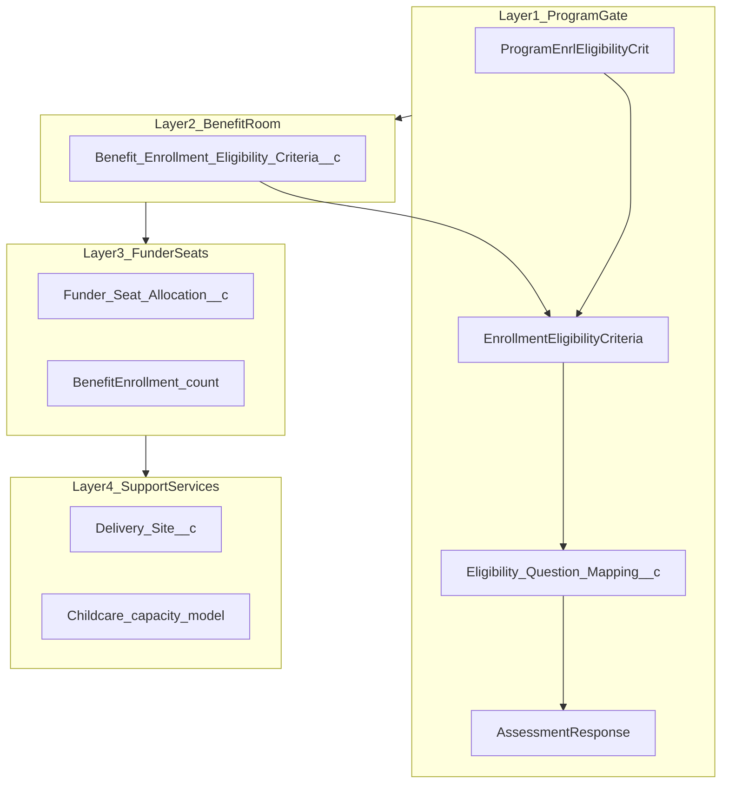
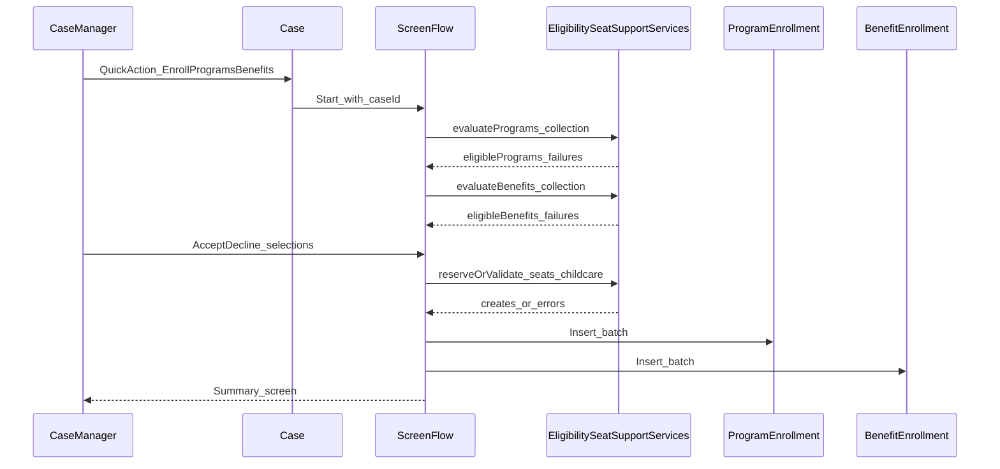

# ISANS — Coordinated enrollment (plan iteration)

## Decisions (confirmed)

- **Repository**: **This repository (`ISANS/ISANS`) is the canonical Salesforce DX project for the ISANS enrollment demo.**
- **First milestone**: **Refined spec + Cursor prompt pack + diagrams only**—no deployment to a Salesforce org in this phase. Implementation (metadata, Apex, Flow) is **phase 2** after org/NPC object availability is confirmed.

## Provenance

An earlier draft of this plan was written in another Cursor workspace (alongside an unrelated Slack fundraising bot repo). **This file is the maintained copy** for ISANS enrollment demo scope, milestones, and technical decisions.

## Target org verification (latest)

Pinned CLI org **`vscodeOrg`**: object-level pass/fail and reproduce commands are in [org-object-verification-vscodeOrg.md](org-object-verification-vscodeOrg.md).

## Goals (milestone 1)

- Produce an **implementation-ready specification** that another builder (human or AI) can follow without inventing rules in code.
- Deliver a **Cursor prompt pack**: master prompt + slices (data model, eligibility engine, seat allocation, support services, Flow, tests).
- Add **architecture diagrams** (layer model + runtime sequence from Case button to enrollments).
- Flag **accuracy risks** from the source canvas (AI-generated): verify every **standard NPC object/field API name**, relationship names, and Discovery Framework objects against **your org’s Schema Builder / Salesforce Help** for your **Nonprofit Cloud / Program Management** version.

## Use case summary (authoritative for design)

**Actor**: Case Manager on **Case** (client context via related Person Account).

**Outcome**: Enroll client in **Program** / **Benefit** only when **program gate**, **benefit room**, **funder seat pool**, and **support services** (childcare first; transport/accessibility later) can be satisfied together; persist **ProgramEnrollment** / **BenefitEnrollment** with **seat**, **funder**, and **status** (Applied / In Progress / Waitlisted) driven by configuration.

**Happy path example**: LINC Basics at Mumford Mon 1–2pm; childcare available; eligible IRCC-funded seat; assign seat + funder; enroll.

## Eligibility and checks (design layers)

**Waterfall semantics (must be nailed in spec, not left implicit)**

- **Per-rule mapping evaluation**: Your prompt says multiple mappings pass if **ANY** satisfies target (OR within rule). Confirm this is desired vs “all mappings must pass” for certain `Requirement_Severity__c` values.
- **Logic_Group__c**: Spec should define precisely:
  - Rules sharing the same `Logic_Group__c` → **OR** (pass at least one rule in the group).
  - Distinct group values → **AND** (pass every group).
- **Program vs Benefit**: Same engine, different junction source (`ProgramEnrlEligibilityCrit` vs `Benefit_Enrollment_Eligibility_Criteria__c`); benefit junction must expose `Logic_Group__c` / `Failure_Message__c` as you listed.

**Bulkification (phase 2)**

- Invocable / service entry points accept **collections** of `(accountId, programId, benefitId)` tuples (or equivalent) and return structured results per row—no SOQL in loops; cache rules/mappings/responses by Id sets.

## Screen Flow vs LWC (milestone 1 decision record)

| Option | Pros | Cons |
|--------|------|------|
| **Screen Flow only** | Faster MVP; declarative fault handling | Rich “card Accept/Decline” UX is clunky; dynamic lists need collection formulas/subflows |
| **LWC + Flow or LWC + Apex** | Card UI, better multi-select | More code; must handle CRUD/FLS and testing |

**Recommendation for spec**: Define **Flow as orchestration** (steps 1–7) with **Apex invocables** for eligibility, seats, childcare; optionally **embed LWC** in Flow screens for steps 2–3 if UX is non-negotiable. Milestone 1 doc should state the **chosen UX path** explicitly before build.

## Runtime sequence (Case → enrollments)

## Data model — build list (phase 2) / verify list (milestone 1)

**Standard / product (verify API names in org)**

- Program, Benefit, BenefitSchedule, BenefitSession, ProgramEnrollment, BenefitEnrollment
- EnrollmentEligibilityCriteria, ProgramEnrlEligibilityCrit (name may vary by release—**verify**)
- AssessmentQuestion, AssessmentQuestionSourceDocument, AssessmentResponse (storage pattern: **confirm** JSON vs related records in your org)

**Custom (spec defines full metadata in milestone 1 doc)**

- `Benefit_Enrollment_Eligibility_Criteria__c` (MD to criteria + benefit; fields as given)
- `Eligibility_Question_Mapping__c` (MD to criteria + question; overrides)
- `Delivery_Site__c` (location + childcare/transport/access)
- `Funder_Seat_Allocation__c` (per your prompt: link to **BenefitSchedule**; funder; seat range; eligible iCARE multi-select)
- Person Account fields: immigration category, iCARE, CLB, support services multi-picklist, region

**Case linkage**

- Flow starts from **Case**; spec must state how to resolve **client Account Id** (e.g. `Case.AccountId` for Person Account, or Contact → Account—**confirm** ISANS Case model).

## Funder seat allocation (spec detail needed)

- Define whether seat numbers are **global per BenefitSession** or **per schedule**; how `Seat_Range_Start__c` / `End__c` interact with **BenefitEnrollment** fields (seat number field API name on enrollment).
- Define **concurrency**: demo may ignore locking; production spec should mention optional **short-term reservation** (platform cache / custom object) vs “check-then-insert” race.

## Childcare / support services (spec detail needed)

- If “Care for Newcomer Children” on Account: load `Delivery_Site__c` from Benefit’s site; require `Childcare_Enabled__c`; compute used vs `Default_Childcare_Capacity__c`.
- Clarify **what is counted**: you wrote “existing BenefitEnrollments for the **Childcare benefit**” at same site/session window—implies a **separate Benefit** record for childcare, or a **childcare enrollment** object. **Milestone 1 spec must choose one model** or the build will guess wrong.
- **Alternative session** message: define algorithm (e.g. next N sessions same benefit, same region, childcare capacity > used) and cap query scope for limits.

## Custom exceptions (phase 2 pattern)

- `ProgramEligibilityException`, `BenefitEligibilityException`, `SeatAllocationException`, `SupportServiceException`
- Each carries **user-safe message** + optional **developer/context** (e.g. failing criterion Id, source document Id).
- Flow: use **Fault connectors** or invocable “Result” wrapper with `success` + `errorType` + `message` so Screen Flow can show plain language without exposing stack traces.

## Milestone 1 deliverables (files to create or extend in this repo)

This consolidated plan lives in **`docs/ISANS-coordinated-enrollment-plan.md`**. Optional follow-on splits (same content, easier navigation):

- `README.md` — scope, NPC version assumptions, “verify before build” checklist (can extend the project README)
- `docs/01-use-case.md` — scenario, personas, happy/unhappy paths
- `docs/02-data-model.md` — ERD description + object/field tables + open questions
- `docs/03-eligibility-engine.md` — grouping semantics, operators by `Data_Type__c`, examples
- `docs/04-flow-spec.md` — step-by-step Screen Flow with inputs/outputs per invocable
- `docs/05-cursor-prompts.md` — master + module prompts (or `prompts/*.md`)
- `sfdx-project.json` + `force-app/main/default/` — phase 2 implementation home (already present)

## Accuracy and safety notes (from AI canvas)

- Treat the original canvas as **draft**: validate **funder rules**, **IRCC vs provincial** copy, and **any legal/compliance statements** with ISANS subject-matter experts before using in production messaging.
- **No hardcoded IDs/values in Apex/Flow** (your rule)—configuration via custom metadata or the rule objects only.

## Phase 2 (deferred) — implementation outline

1. Scratch/sandbox with **NPC licenses**; enable features; confirm object/field availability.
2. Metadata: custom objects/fields, layouts, permissions (permission set for Case Managers).
3. Apex: `EligibilityWaterfallService` + invocables + tests (bulk, mixed pass/fail).
4. Screen Flow + Quick Action on Case; fault handling to user messages.
5. Optional LWC for selection UI; Jest + Flow tests as feasible.
6. Sample data script (Anonymous Apex or `sf data` seed) for demo.

## Open questions resolved later (not blocking milestone 1 doc)

- Exact **AssessmentResponse** retrieval pattern in your org.
- Whether **Program capacity** (step 5) is a field on Program, related rollups, or external definition.
- **Task** creation for Program Manager when status = Applied (record-triggered Flow vs subflow).

---

**Execution gate**: Starting implementation (phase 2) should wait until you send **NPC org type/version** (or a scratch def feature list) and confirm **Case → client Account** resolution. Milestone 1 can proceed as pure documentation + prompts in this repo.
